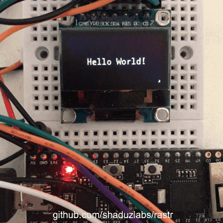
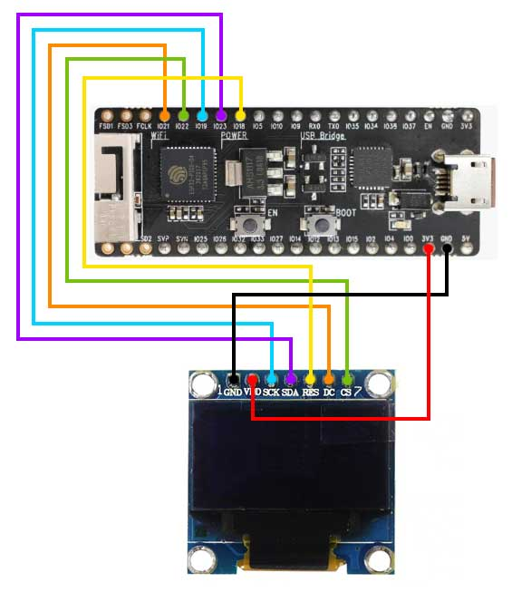

# Using a SSD1306 OLED display with rastr on ESP32

 

This simple demo shows how to use the [rastr](https://github.com/shaduzlabs/rastr), a tiny graphic library, to draw to an SSD1306 based OLED display connected via SPI to an ESP32.
After installing the toolchain, as explained in the [getting started](https://docs.espressif.com/projects/esp-idf/en/latest/get-started/) section of the ESP documentation, follow these steps:
- Clone this repository **recursively**: `git clone https://github.com/shaduzlabs/sl-esp32-ssd1306-example.git --recursive`
- Go to the example repository directory: `cd sl-esp32-ssd1306-example`
- Configure the project (e.g. the serial port of your device, etc.): `make menuconfig`
- Build the example: `make`
- Flash your device: `make flash`
- Done :)

## Connections

This example has been tested on an [ESP32 Pico D4 Kit](https://docs.espressif.com/projects/esp-idf/en/latest/get-started/get-started-pico-kit.html), the table and the picture below show the connections between the display and the board. The pins can be changed from the configuration menu (see *SSD1306 Configuration*).

| SSD1306            |  ESP32    |
|--------------------|:---------:|
| VDD                | 3.3V / 5V |
| GND                | GND       |
| SCL (clock)        | 19        |
| SDA (data)         | 23        |
| D/C (data/command) | 21        |
| RST (reset)        | 18        |
| CS  (chip select)  | 22        |

